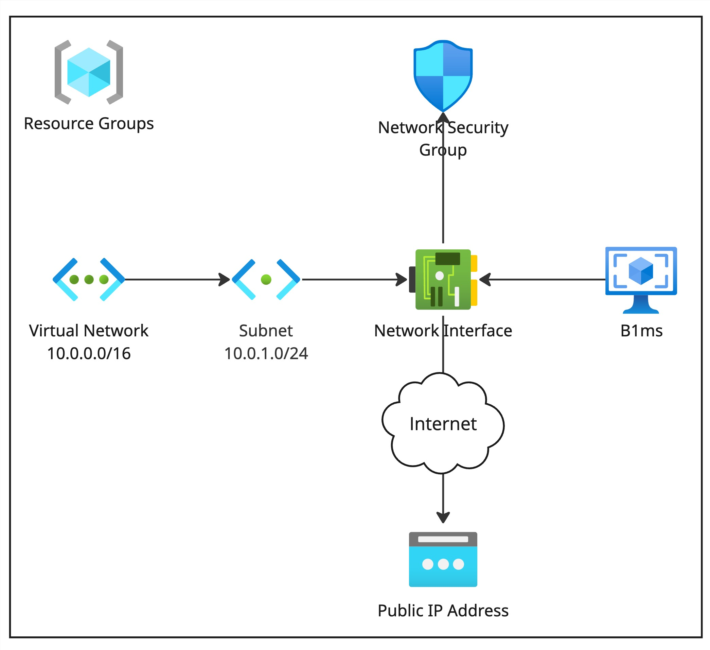

# Bewerberaufgabe

## Inhaltsverzeichnis

- [Projektübersicht](#projektübersicht)
- [Architektur](#architektur)
- [Komponenten](#komponenten)
- [Verwendung](#verwendung)
- [Mögliche Erweiterungen/Verbesserungen](#mögliche-erweiterungenverbesserungen)

## Projektübersicht

Das vorliegende Projekt implementiert eine Container-Umgebung (Docker) in einer virtuellen Maschine auf Azure. Der Webserver dient als Reverse Proxy für einen Keycloak-Container, welcher wiederum den Zugriff auf den Webserver steuert. An den Keycloak-Container ist eine Postgres-Datenbank angebunden. Die Infrastruktur wird mit Terraform erstellt und mit Ansible konfiguriert. GitHub Actions werden für Deployment, Konfiguration und Abbau verwendet.

## Architektur

## Komponenten

- **Netzwerk**: Das sind die minimalen und notwendigen Komponenten zur Erstellung eines Netzwerks sowie der Zuweisung einer öffentlichen IP-Adresse. Die Security Group beschränkt den Zugriff auf die Ports für HTTP/S und SSH. Der SSH-Zugriff sollte auf einzelne IP-Adressen beschränkt sein oder aber die Verwendung eines Bastion-Host in Betracht gezogen werden. Um den Aufwand für die Aufgabe gering zu halten, wurde darauf bewusst verzichtet.

- **VM**: Bei der virtuellen Maschine wurde auf eine Linux-basierte Maschine gesetzt, welche geringfügige Kosten verursacht, aber ausreichend Ressourcen zur Ausführung der erforderlichen Container-Umgebung sowie der Container selbst bereit hält. Die Verwendung einer kleineren Instanz (B1s) führte dazu, dass die Verbindung zur Maschine verloren ging, als der Keycloak-Container gestartet wurde. Des Weiteren erfordert Keycloak laut Dokumentation knapp 1250 MB RAM. Die weiteren Container benötigen für den minimalen Betrieb nur einen Bruchteil der Ressourcen von Keycloak.

- **Ubuntu Server 24.04 LTS**: Bei der Wahl des Images für die VM wurde auf Ubuntu Server in der aktuellsten Version mit Long-Term-Support gesetzt. Es bietet einen guten Support für die verwendete Software sowie lange und regelmäßige Unterstützung mit Sicherheitsupdates.

- **Docker**: Die Wahl der Container-Laufzeitumgebung fiel auf Docker, da in der Vergangenheit bereits gute Erfahrungen mit Docker gesammelt wurden sowie Docker eine gute Integration in Ansible samt Dokumentation genießt. Dies erlaubt eine schnelle Einrichtung der notwendigen Ressourcen.

- **Nginx**: Beim Webserver wurde ebenfalls aus guten persönlichen Erfahrungen auf Nginx gesetzt. Um die Zugriffsteuerung des Webservers zu ermöglichen, kann Lua-Code innerhalb der Nginx-Konfiguration angegeben werden. Da das Basis-Container-Image keine Lua Unterstützung mitbringt, wurde die Nginx-Distribution OpenResty verwendet. Alternativ wurde der Webserver Apache getestet, jedoch konnte dieser durch mich nicht korrekt konfiguriert werden.

- **Docker-Images**: Bei der Wahl der Docker-Images wurde darauf geachtet, nach Möglichkeit Alpine-basierte Images zu verwenden. Dies verringert nicht nur den Speicherbedarf, die Build-Zeiten sowie den Ressourcenverbrauch, sondern verringert durch das Weglassen vieler Komponenten auch die Angriffsfläche bei potenziellen Angriffen.

## Verwendung

Das Projekt bietet drei Workflows, welche die notwendige Infrastruktur mittels Terraform in einen Azure Account aufbaut und abbaut sowie mittels Ansible konfiguriert.

- **Deploy**: Notwendige Infrastruktur wird mittels Terraform bereitgestellt.
- **Configure**: Ansible richtet in der bereitgestellten VM die notwendinge Software ein und konfiguriert diese so, dass diese wie der Aufgabe entsprechend, verwendet werden kann. Es wird unter anderem ein neuer Client (nginx) und Nutzer (user1:test) angelegt.
- **Destroy**: Löscht die gesamte Infrastruktur, welche durch den Deploy-Workflow erzeugt wurde.

Die Workflows müssen manuell ausgeführt werden und starten nicht automatisch.

### Umgebungsvariablen

Bevor die Workflows ausgeführt werden können, müssen noch Umgebungsvariablen angelegt werden. Dazu ist es notwendig, Azure-Zugangsdaten für die Verwendung durch Terraform in der Pipeline zu erzeugen, z. B. mittels [Service Principal with a Client Secret](https://registry.terraform.io/providers/hashicorp/azurerm/latest/docs/guides/service_principal_client_secret).

| Variable                | Secret | Kommentar                                                                                       |
| ----------------------- | ------ | ----------------------------------------------------------------------------------------------- |
| LOCATION                | ❌     | Die Region, in der die Ressourcen angelegt werden sollen.                                       |
| SUBSCRIPTION_ID         | ❌     |                                                                                                 |
| CLIENT_ID               | ❌     | Auch `appId` genannt.                                                                           |
| CLIENT_SECRET           | ✅     | Auch `password` genannt.                                                                        |
| TENANT_ID               | ❌     |                                                                                                 |
| GH_PAT                  | ✅     | _Github Personal access token_ mit Schreib- und Leserechten zu _Actions variables and secrets_. |
| KEYCLOAK_ADMIN_PASSWORD | ✅     | Das Passwort des temporär erstellten Admins (tmpadm) zur Anmeldung an der Keycloak-Oberfläche.  |

## Mögliche Erweiterungen/Verbesserungen

- Einrichtung einer Domain samt Loadbalancer, Firewall und CDN
- Gültiges Zertifikat, welches sich automatisch verlängert (erfordert die Einrichtung einer Domain)
- Redundanzen aufbauen (als Cluster, mehrere Instanzen, mehrere Datenbanken)
- Backupstrategie notwendiger Daten
- Die Verwendung alternativer Containerumgebungen in Betracht ziehen (Podman, Managed Container, Kubernetes)
- Workflows miteinander kombinieren sowie automatisches Ausführen bei Push oder durch Merge-/Pull-Requests
- Terraform-Workflows optimieren, indem _plan_ und _apply_ durch einen Pull-Request abgesichert werden
- Die Verwendung von Keys statt Passwörtern (bei SSH)
- Passwörter nach Möglichkeit über Passwortfiles in der Pipeline verarbeiten, da diese sonst im Log stehen
- Health-Endpunkte für Container definieren/konfigurieren
- Monitoring aufsetzen, um bei Ausfällen schneller reagieren zu können
- Ansible-Tasks mit Bedingungen erweitern, sodass diese nicht immer ausgeführt werden
- Delay nach Einrichtung des KeyCloak-Container entfernen (mögliche Lösung mittels Healh-Endpunkt)
- Anstatt das Backend für den Remote State mittels Terraform (oder Pipeline insgesamt) zu implementieren, ist die Verwendung der Azure CLI denkbar
- Datenbankpasswort nicht Klartext im Code ablegen
